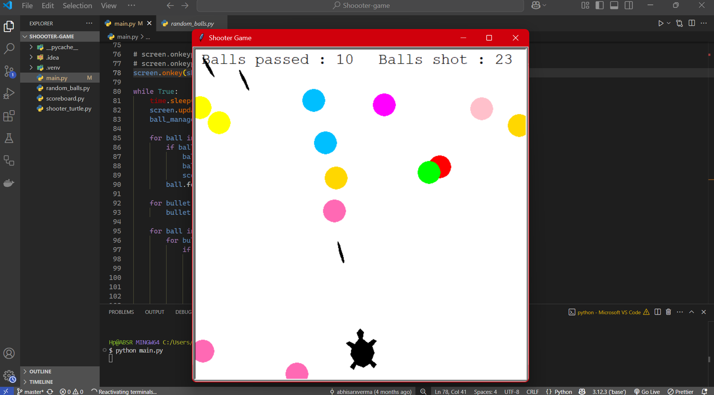

# 🐢 Turtle Shooter Game

> _"Built during a moment of frustration, this little project became my creative escape."_  

---

## 🎮 What is this?

A **simple shooter game** built using Python’s `turtle` module.

- Enemies move down the screen ⬇️
- Player can shoot bullets upward ⬆️
- Collision detection & game-over logic included
- Basic **OOP (Object-Oriented Programming)** concepts applied

---

## 💡 Key Highlights

- Written just 2 months into my programming journey
- One of my first uses of **classes**, **objects**, and **inheritance**
- Inspired by arcade-style shooter games
- Not perfect — the UI is clunky, the code is naive — but it **gave me immense satisfaction** 🧠✨

---

## 🔧 Technologies

- Python 3.x
- `turtle` module (built-in GUI)
- OOP principles

---

## 📸 Screenshot



---

## ⚠️ Known Imperfections

- Basic UI, lacks polish
- No background music or effects
- Game loop could be optimized

> Still, the joy of seeing bullets fire and enemies explode — **totally worth it.**

---

## 🚀 How to Run

```bash
python shooter_game.py
